  

  <h2> About Me 🍊 </h2>

  Hi! I'm Rodny, a passionate self-taught <b>Fullstack Developer 💻.</b>

- [x] 🍕 Coffee and pizza addict (the perfect coding fuel!).  
- [x] 🐧 Linux geek.  
- [x] 🤖 Lover of web technologies, both server-side and client-side. Always eager to learn and build new things ✨.

  <h2> <- SKILLS -> </h2>

  <h3> _languages </h3>
  

  <h3> _platforms </h3>
  
  

  <h3>_frontend_skills</h3>
  
  
  

  <h3> _databases </h3>
  

---

  
  

